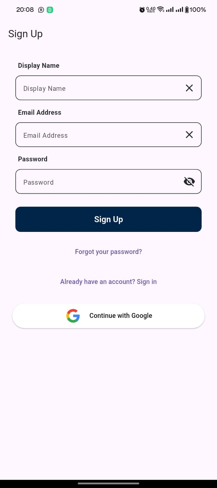
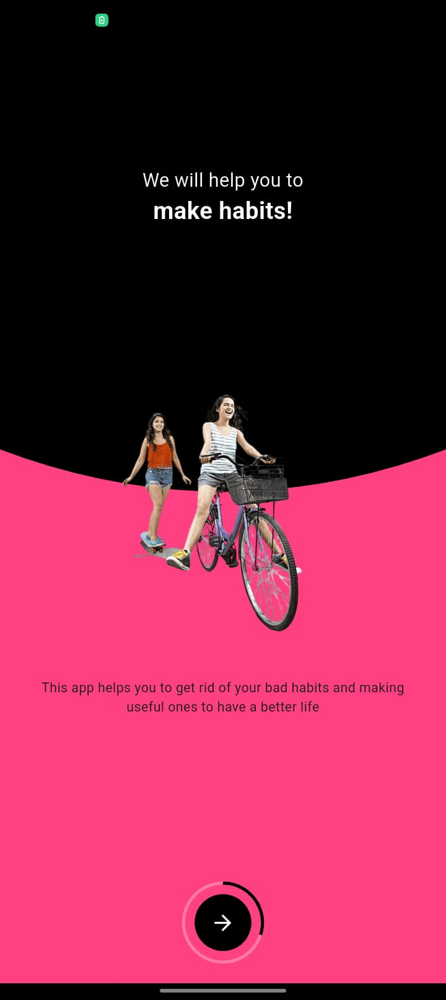
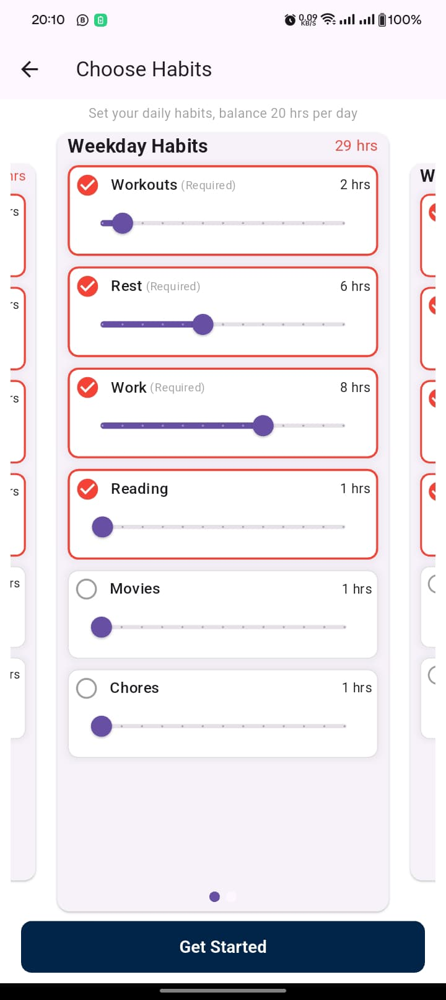
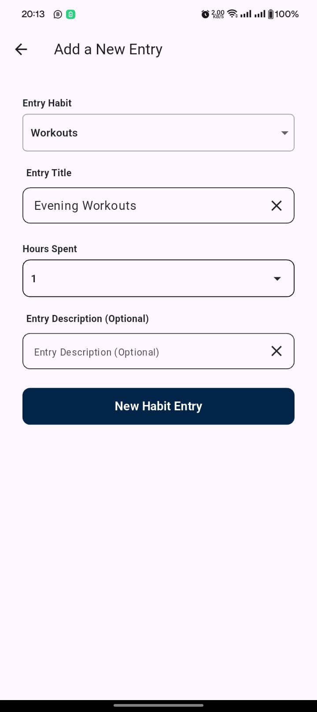
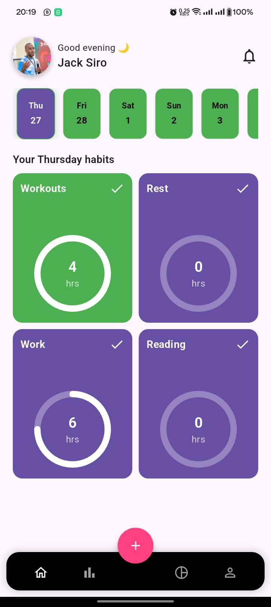
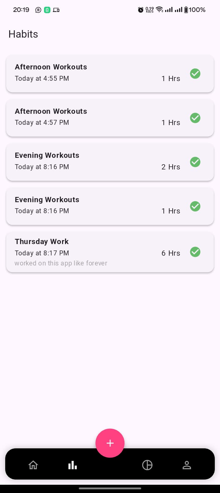

# Botambe

a Gamified Habit Tracker App in Flutter

## Plugins Used
1. Supabase for backend and auth
2. Floor for local storage
3. Flutter Bloc for state management

## Screenshots
<table>
    <tr>
        <td></td>
        <td></td>
        <td></td>
        <td></td>
    </tr>
</table>
<table>
    <tr>
        <td></td>
        <td></td>
        <td></td>
        <td></td>
    </tr>
</table>

## Getting Started

Follow this guide to set up and run the Botambe:

### Setting Up the App:

1. **Install Flutter and Dependencies:** Ensure Flutter is installed on your system. Download the Flutter SDK from the official website and set up your preferred IDE (e.g., Android Studio or Visual Studio Code) with the Flutter plugin.

2. **Clone the Repository:** Clone the Botambe repository from GitHub using Git:

    ```bash
    git clone https://github.com/SiroDaves/Botambe.git
    ```

3. **Install Packages:** Navigate to the project directory and run:

    ```bash
    flutter pub get
    ```

4. **Setup Code Generated Files:** Run the following command to do auto generation of code:

    ```bash
    dart run build_runner build --delete-conflicting-outputs
    ```

5. **Setup Supabase Keys:** Copy paste the file ```keys.example``` to the project directory.
    - Rename the copied file as ```keys-prod.json```. 
    - Replace the empty value of ```supabaseUrl``` and ```supabaseAnonKey``` with your supabase keys

6. **Run the App:** Execute the following command to run the app:

    ```bash
    flutter run --dart-define-from-file keys-prod.json
    ```

### Building the Botambe:

- **Android build:**

    ```bash
    flutter build apk --dart-define-from-file keys-prod.json --no-tree-shake-icons
    ```

- **iOS Build:**

    ```bash
    flutter build ios -t lib/main.dart --dart-define-from-file keys-prod.json --no-tree-shake-icons --build-name
    ```

Congratulations! You've successfully set up and run or built the Botambe. Explore the codebase, make modifications, and contribute to creating a seamless experience on the app. Happy coding!

### Deploying Flutter Web App to Vercel
**Prerequisites**

- Flutter SDK installed and configured
- Vercel account
- Node.js and npm installed

Ensure your Flutter project supports and runs on the web.

1. **Set Up Vercel**

Install the Vercel CLI

```bash
npm i -g vercel
```

Then, log in to your Vercel account
```bash
vercel login
```

2. **Configure Vercel Deployment**

Create a `vercel.json` file in your project root:

```json
{
  "version": 2,
  "routes": [
    {"handle": "filesystem"},
    {"src": "/(.*)", "dest": "/index.html"}
  ]
}
```

3. **Build Your Flutter Web App**
```bash
flutter build web --dart-define-from-file keys-prod.json --no-tree-shake-icons
```

4. **Deploy to Vercel**

Navigate to your build/web directory
```bash
cd build/web
```

Finally deploy the app by running:
```bash
vercel --prod
```
When prompted to configure your project, follow these steps:

a. When asked "Which settings would you like to overwrite", select:
   - Build Command
   - Output Directory

b. For the settings:
   - **Build Command**: Leave empty (since you've already built your app)
   - **Output Directory**: Enter `.` (current directory)

These settings tell Vercel that you're deploying pre-built files from the current directory without needing additional build steps.


## CI/CD Pipeline

CI/CD pipeline for this project has been implemented using GitHub Actions and consists of three main jobs:

### 1. Test Job
- Runs on Ubuntu latest
- Sets up Flutter 3.27.1
- Gets dependencies
- Runs tests with coverage
- Uploads coverage report as artifact

### 2. Build Job
- Triggers after successful tests
- Builds web version
- Builds Android APK
- Deploys to Firebase hosting
- Uploads APK as artifact

### 3. Release Job
- Creates GitHub release
- Uploads APK to release
- Automatically versions releases (v1.0.x)

### Pipeline Triggers
- Activates on push to main branch
- Requires following secrets:
  - FIREBASE_TOKEN
  - GTH_TKN (GitHub Token)

## CI/CD Status
[](https://github.com/SiroDaves/Botambe/actions/workflows/main.yml)

## Getting Started with Flutter

For help getting started with Flutter development, view the
[online documentation](https://docs.flutter.dev/), which offers tutorials,
samples, guidance on mobile development, and a full API reference.